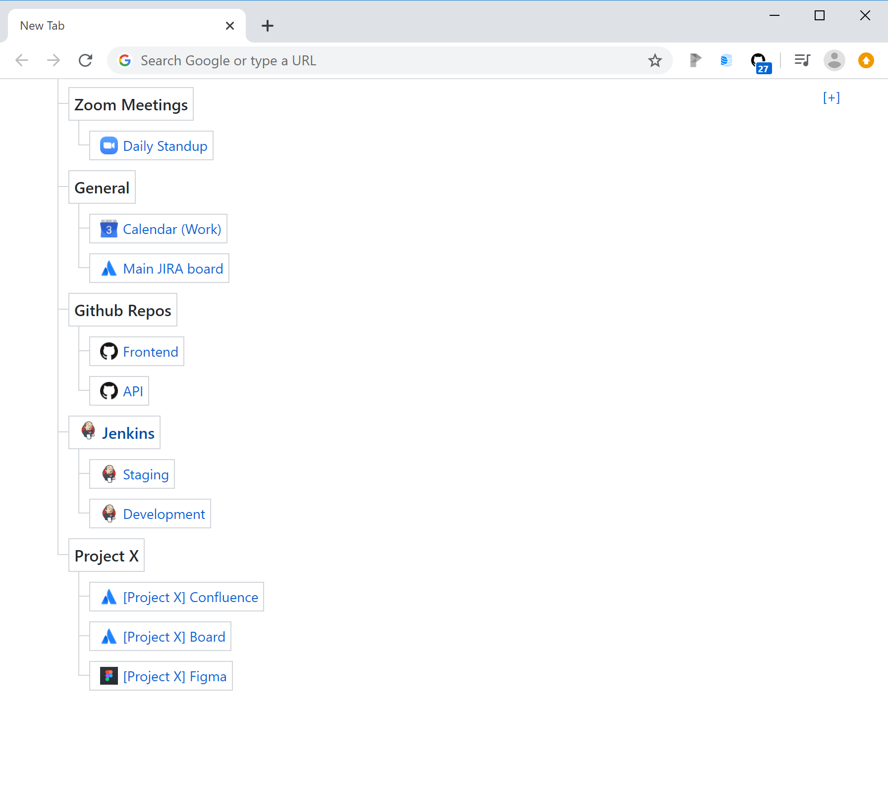

# Zero State Chromium

Add links and notes to your New Tab page. Organize them as a single list, a tree, or multiple lists/trees.

Replaces the default New Tab page in Chromium browsers (Chrome + Edge)

## Features:
- Ultralight - Vanilla JS + CSS, no third party libraries or bundles
- Synchronizes - if you are signed into Chrome on multiple devices, changes propagate instantly to all
- Unopinionated - you organize your stuff however you see fit. Doesn't try to force todo list format or a calendar view or agenda. It's just trees.
- Safe - there are lots of New Tab pages on the Chrome web store but almost all of them are collecting data, sliding referral links into your cookies. redirecting your searches through their proxies, and/or something else behind the scenes. If it's free and actively developed and cutely marketed and not open source you should really be suspicious. Ads and scams are pretty much the only available monetization path for chrome extensions so it's not really their fault 🙂

### How to use:
- First time you load a new page it will probably look like it didn't work, as it's completely empty. Look at the top right and see the button.
- Click the [+] icon to add a new node
- Type a name (Required), must be unique.
- URL not required, if none it will just be a black node, useful as a simple text note.
- Parent: not required, but if you want to add an item as a child of another node (i.e. add it to a folder), type the exact name of the target
  + Note: you can nest items infinitely but probably you will see glitches past the 2nd or 3rd level.
- To delete things, open the Add form again ([+] icon) and some sort of delete button will appear next to leaf nodes. Leafs are any items with no children. If you want to delete a folder delete the children first.
- To mark something as done without deleting it yet, you can right click on the node and it a strikethrough effect will be applied.

### Early screenshot

### todo
- manual light/dark mode toggle (update - dark mode is now supported but it only follows the system setting, no manual override yet)
- revisit the right-click "mark as completed" action - it's dead simple and no extra UI but not always intuitive and overrides the default right click context menu
- revisit edit mode toggle behavior.. the Create form auto-hiding after adding something can be annoying when trying to add multiple items
- inline edit for editing nodes in-place rather than deleting+recreating them
- inline edit for adding children to nodes rather than having to type the parent name exactly in the create form
- reconsider a delete confirmation button.. I don't really like confirmations but i have deleted things accidentally before and caused me great pain
  + maybe not a confirmation, but an undo button? everyone prefers this UX but it is a bit harder to implement

"inspiration" for design:
- https://codepen.io/mofies/pen/xJmpwZ
- https://codepen.io/Cweili/pen/EVoeKv
