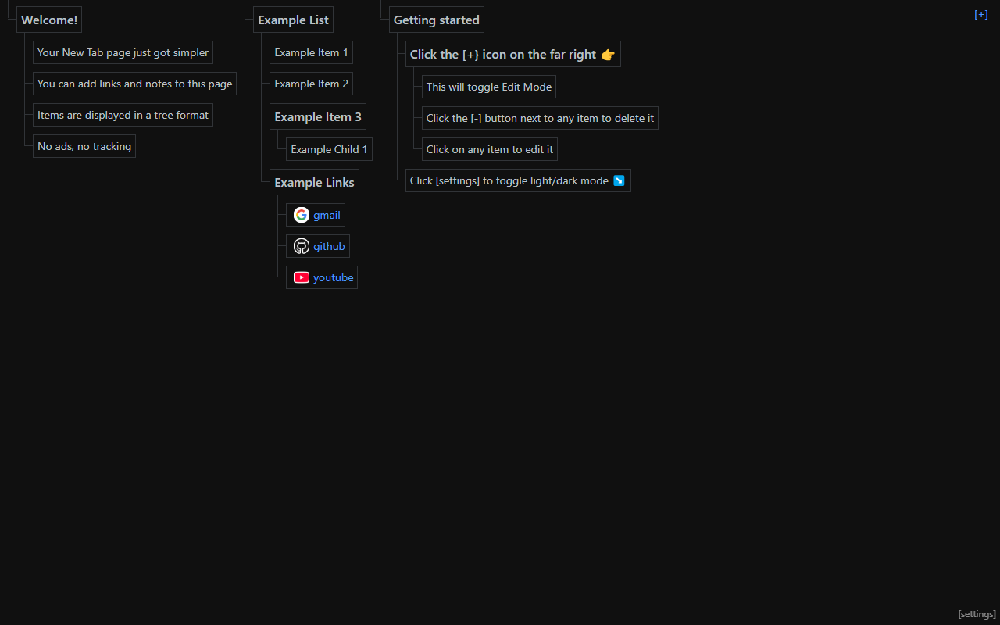
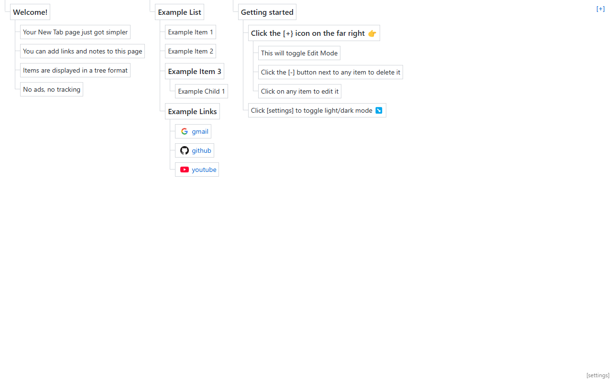
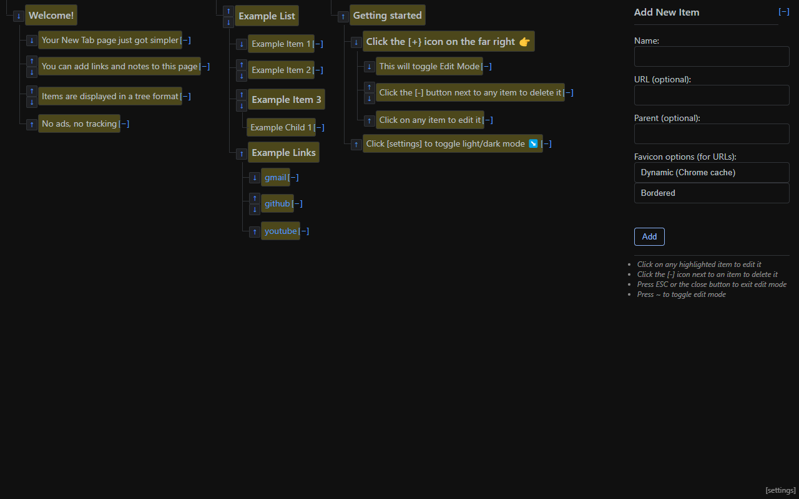
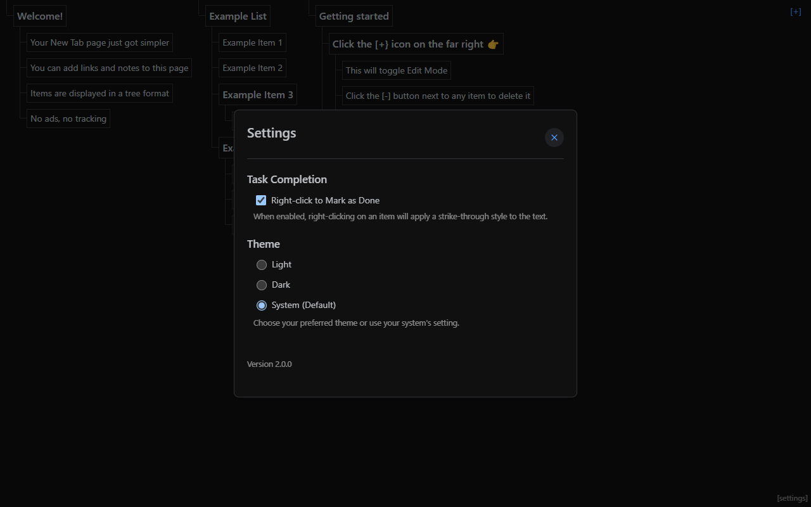

# zero state: replacement New Tab page

**Transform your New Tab page into a blank space for links and notes.**

Developed for personal use, not guaranteed to fit everyone's needs. I use it for bookmarks mainly.

Chrome web store: https://chromewebstore.google.com/detail/zero-state/diloncejoolaamlldicgmhimamhecipj

## Cool features

- **Ultralight** - ~no dependencies, vanilla JS only~ 2.0.0 update: Uses VanJS https://vanjs.org/, a super lightweight framework
- **Private** - No tracking or third-party servers; all data stays in your browser
- **Flexible Organization** - Arrange content as lists, trees, or both based on your workflow
- **Syncs Automatically** - Changes are synchronized across all your devices via the official Chrome Storage API (if you're signed into a chrome profile)

## Drawbacks

- UI is a bit clunky and mainly designed for "set it and forget it" operation.
- Checklist feature is half-baked

## Getting Started

1. **Add items** with the [+] button in the top right
2. **Create nodes** with a unique name (URLs optional)
3. **Build hierarchies** by specifying parent nodes
4. **Mark as complete** with right-click for strikethrough effect (can be disabled in settings for normal right-click behavior)
5. **Remove items** using the delete button (appears next to leaf nodes when in edit mode)

## Screenshots

Design inspiration:
- https://codepen.io/mofies/pen/xJmpwZ
- https://codepen.io/Cweili/pen/EVoeKv
