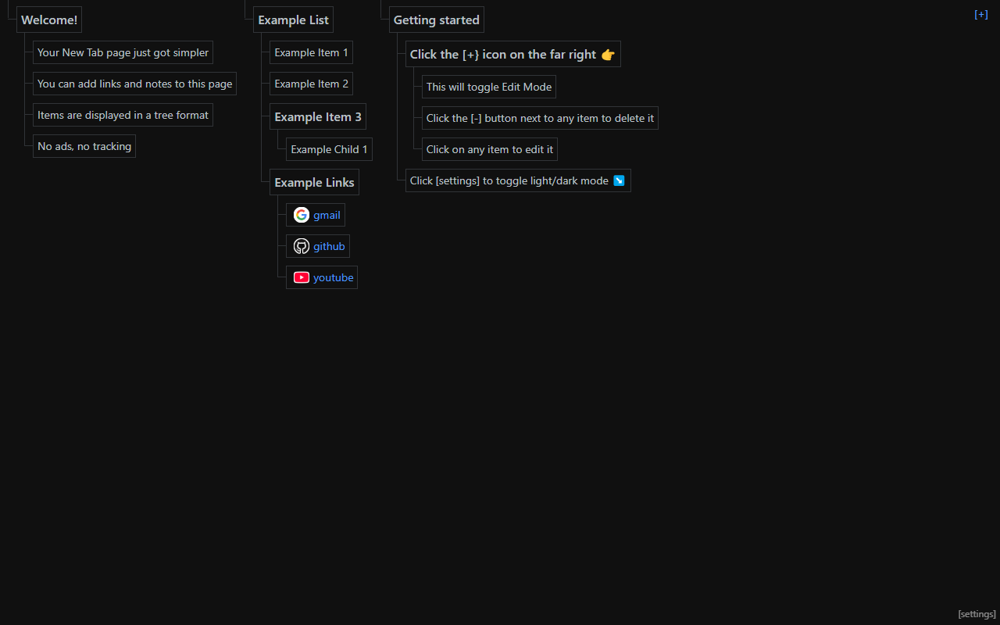
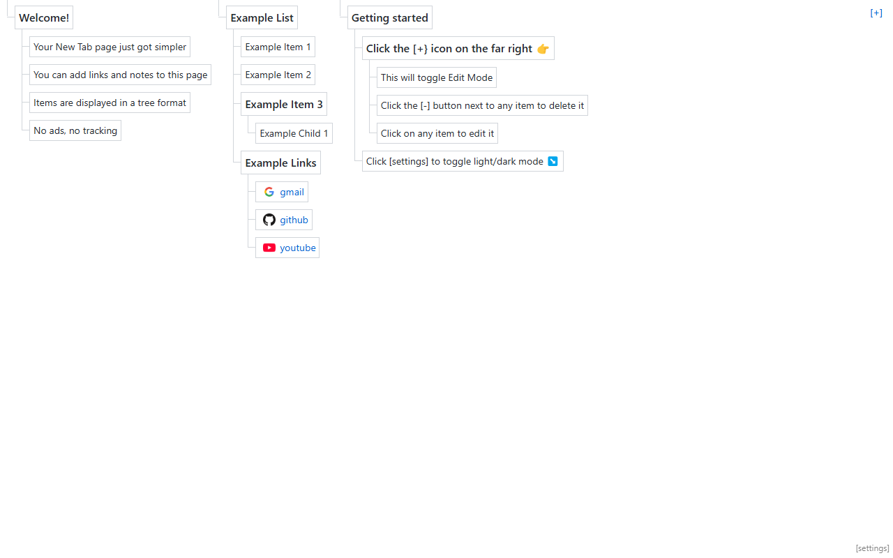
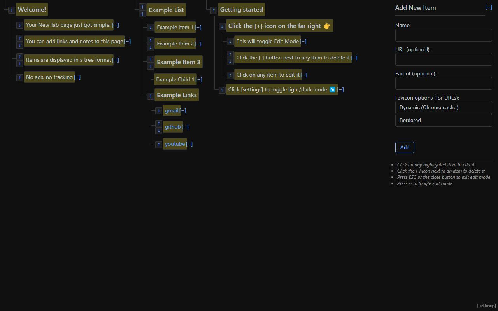
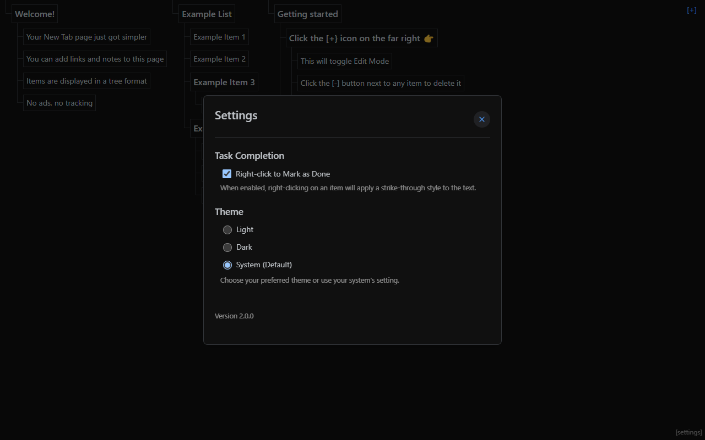

# zero state: replacement New Tab page

**Transform your New Tab page into a blank space for links and notes.**

Developed for personal use, not guaranteed to fit everyone's needs. I use it for bookmarks mainly.

Chrome web store: https://chromewebstore.google.com/detail/zero-state/diloncejoolaamlldicgmhimamhecipj


## Cool features

- **Ultralight** - ~no dependencies, vanilla JS only~ 2.0.0 update: Uses VanJS https://vanjs.org/, a super lightweight framework
- **Private** - No tracking or third-party servers; all data stays in your browser
- **Flexible Organization** - Arrange content as lists, trees, or both based on your workflow
- **Syncs Automatically** - Changes are synchronized across all your devices via the official Chrome Storage API (if you're signed into a chrome profile)

## Drawbacks

- UI is a bit clunky and mainly designed for "set it and forget it" operation.
- Checklist feature is half-baked


## Getting Started

1. **Add items** with the [+] button in the top right
2. **Create nodes** with a unique name (URLs optional)
3. **Build hierarchies** by specifying parent nodes
4. **Mark as complete** with right-click for strikethrough effect (can be disabled in settings for normal right-click behavior)
5. **Remove items** using the delete button (appears next to leaf nodes when in edit mode)

## Development

```sh
npm install
npm run watch      # rebuild dist/app.js on change
npm run build      # one-off dev build (with sourcemaps)
npm run build-min  # minified production build
npm run typecheck  # tsc --noEmit
npm test           # vitest unit + jsdom smoke tests
npm run test:e2e   # playwright: drives the extension in real Chromium (once: npx playwright install chromium)
```

Load the repo root as an unpacked extension (`chrome://extensions` → Developer mode → Load unpacked); `manifest.json` points at `static/` and `dist/`. For a store package, run `npm run pkg` and zip the `pkg/` folder.

### End-to-end tests

`npm run test:e2e` loads the repo root as an unpacked extension into a fresh headless Chromium profile per test and drives the real New Tab page: the first-run welcome data, `chrome.storage.sync` round-trips across reloads, cross-tab sync through `onChanged`, the settings modal, and screenshot baselines. Specs live in `e2e/`; `e2e/fixtures.ts` holds the context setup and locator helpers. Add `--headed` or `--ui` to watch a run.

Screenshot baselines in `e2e/visual.spec.ts-snapshots/` are platform-specific. After an intentional visual change, regenerate them with `npx playwright test --update-snapshots`.

Not covered: the native prompt for the optional `favicon` permission, which Playwright cannot click. That flow stays manual.

### Backup and restore from the console

Open DevTools on the New Tab page (F12) and use the helpers on `window.zeroState`:

```js
copy(zeroState.exportData())   // puts a JSON export on the clipboard
zeroState.importData(json)     // replaces the list and settings; takes the JSON text or the parsed object
```

The export is a versioned wrapper around the stored data, so the shape can change later without breaking old files:

```json
{ "format": "zero-state", "version": 1, "exportedAt": "...", "appVersion": "2.0.0", "list": [...], "settings": {...} }
```

Imports are validated first (format and version, node shape, unique names, no parent loops, `settings` optional) and nothing changes if validation fails. Handy for seeding test data: import a small list, poke at it, then import your real export back.

### Architecture

- `src/state.ts` — VanJS reactive state; the display tree and name index derive automatically from the flat `rawList`
- `src/actions.ts` — every user mutation: swap the new list in, persist to `chrome.storage.sync`, roll back on failure
- `src/services/` — pure logic (tree building, validation) and browser wrappers (storage, favicons, theme)
- `src/components/` — VanJS UI components (tree view, edit form, settings modal, footer)

## Screenshots





Design inspiration:
- https://codepen.io/mofies/pen/xJmpwZ
- https://codepen.io/Cweili/pen/EVoeKv
